# System Architecture

> Agentic AI CRM Platform — Component reference and internal diagrams.

---

## Table of Contents

1. [System Overview](#1-system-overview)
2. [Frontend — crm-ui](#2-frontend--crm-ui)
3. [Backend — crm-backend](#3-backend--crm-backend)
4. [Orchestrator — Internal Flow](#4-orchestrator--internal-flow)
5. [Agent Network](#5-agent-network)
6. [Memory System](#6-memory-system)
7. [Streaming Pipeline](#7-streaming-pipeline)
8. [Database Schema](#8-database-schema)
9. [Infrastructure & Observability](#9-infrastructure--observability)
10. [Request Lifecycle — End to End](#10-request-lifecycle--end-to-end)

---

## 1. System Overview

All major services and their primary communication paths.

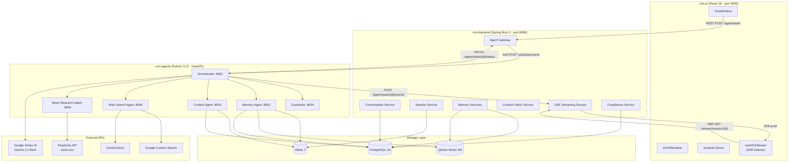

---

## 2. Frontend — crm-ui

Internal component tree, store wiring, and API calls.

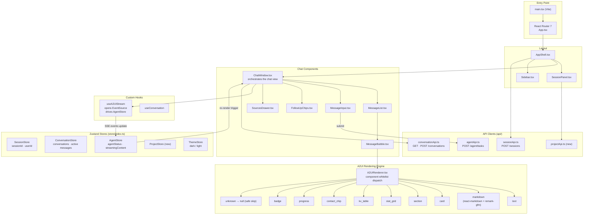

---

## 3. Backend — crm-backend

Package breakdown, service layer, and storage mapping.

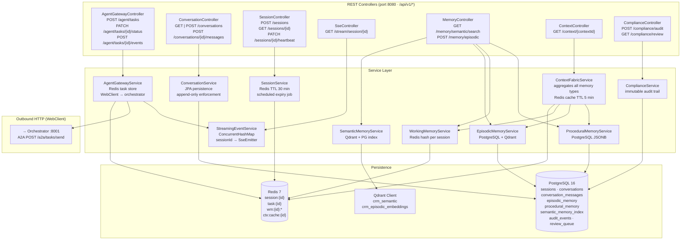

### Session State Machine

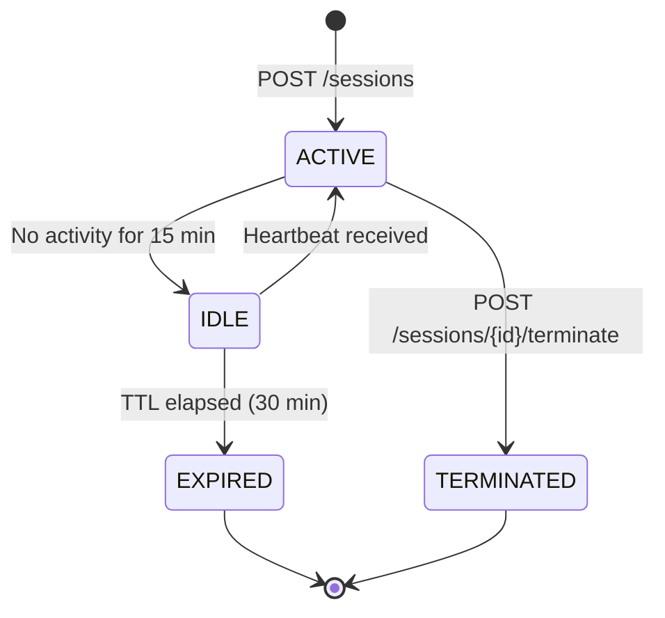

---

## 4. Orchestrator — Internal Flow

`crm-agents/orchestrator/agent.py` — 10-step pipeline executed for every A2A task.

```mermaid
flowchart TD
    Recv["Receive A2A Task\nPOST /a2a/tasks/send"]

    subgraph S1["① Intent Extraction"]
        IntentExtract["Extract intent keywords\nfrom user message text"]
    end

    subgraph S2["② Input Guardrails  (fail-open)"]
        PII_In["PII detection  (Presidio)"]
        InjectionCheck["Prompt injection  (regex)"]
        CredCheck["Credential pattern detection"]
        ToxicCheck["Toxicity check  (optional)"]
    end

    subgraph S3["③ Parallel Context Fetch"]
        direction LR
        FetchCtx["Context Fabric\nGET /context/{id}"]
        FetchMem["Memory Agent\nsemantic_search"]
        FetchHist["Conversation history\nGET /conversations/{id}/messages"]
        WebGate{"Needs\nweb / research?"}
        WebAgent["Web Search Agent :8005"]
        NewsAgent["News Research Agent :8006"]
        WebGate -->|yes| WebAgent & NewsAgent
    end

    subgraph S4["④ LLM Generation  (Gemini 2.x-flash)"]
        StreamPath["generate_stream()\nstreaming response"]
        StructPath["generate()\nstructured response"]
        StreamChunks["POST /agent/tasks/{id}/events\nfor each chunk"]
        StreamPath --> StreamChunks
    end

    subgraph S5["⑤ A2UI Normalisation"]
        EnsureA2UI["_ensure_a2ui()\nnormalise output →\n{type, components[]}"]
    end

    subgraph S6["⑥ Follow-Up Generation"]
        FollowUps["generate_follow_ups()\n3 clickable suggestion chips\nvia secondary Gemini call"]
    end

    subgraph S7["⑦ Output Guardrails"]
        PII_Out["PII redaction  (Presidio anonymizer)"]
        SchemaVal["Pydantic schema validation"]
        HallucinationFlag["Hallucination flagging  (optional)"]
    end

    subgraph S8["⑧ Persist Agent Turn"]
        PersistMsg["POST /conversations/{id}/messages\nrole=agent · trace_id · span_id · token_count"]
    end

    subgraph S9["⑨ Task Completion Callback"]
        PatchStatus["PATCH /agent/tasks/{id}/status\nstatus = COMPLETED"]
    end

    subgraph S10["⑩ Compliance Audit"]
        AuditLog["POST /compliance/audit\naction · resource · severity"]
    end

    Recv --> S1 --> S2 --> S3
    S3 --> S4
    S4 --> S5 --> S6 --> S7 --> S8 --> S9 --> S10
```

### Router — Intent to Agent Mapping

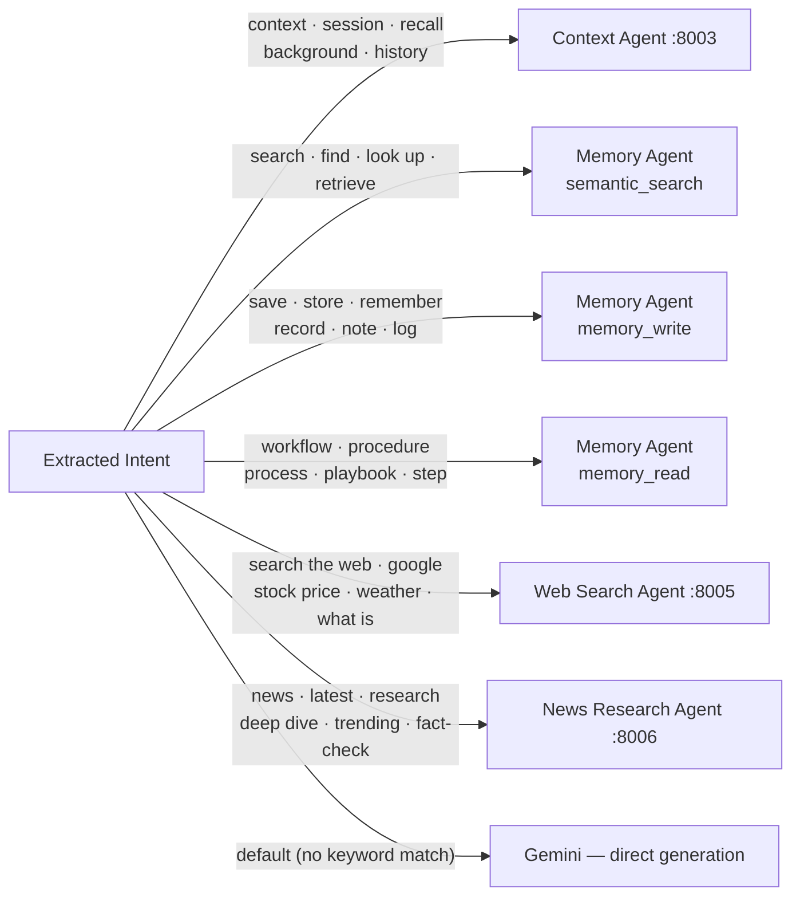

### Task Delegation Modes

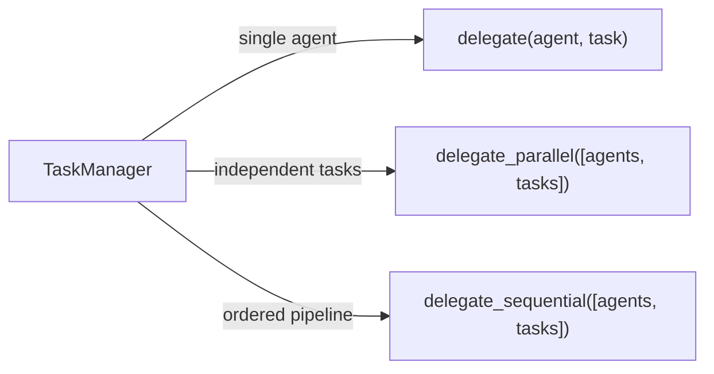

---

## 5. Agent Network

Inter-agent communication via the A2A protocol (Google ADK v0.3).

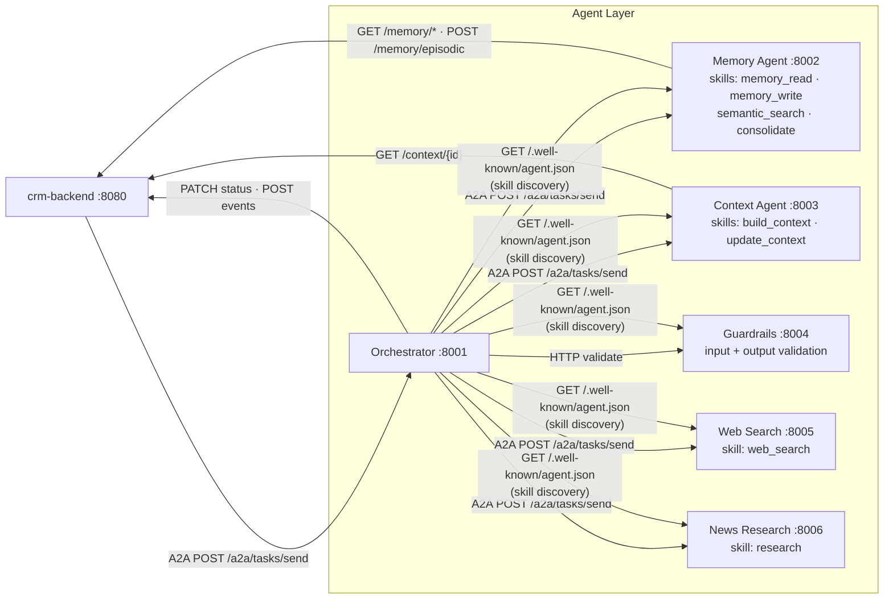

### A2A Task State Machine

```mermaid
stateDiagram-v2
    [*] --> QUEUED : Backend stores task in Redis
    QUEUED --> SUBMITTED : Forwarded to Orchestrator
    SUBMITTED --> STREAMING : Orchestrator begins LLM stream
    STREAMING --> COMPLETED : All chunks sent; callback received
    SUBMITTED --> FAILED : Orchestrator throws error
    STREAMING --> FAILED : Stream interrupted
    COMPLETED --> [*]
    FAILED --> [*]
```

---

## 6. Memory System

Four-tier architecture with per-tier storage and access patterns.

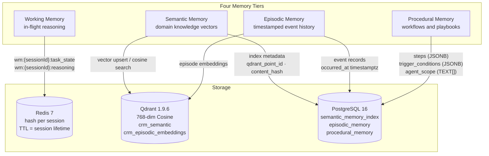

### Context Fabric Assembly

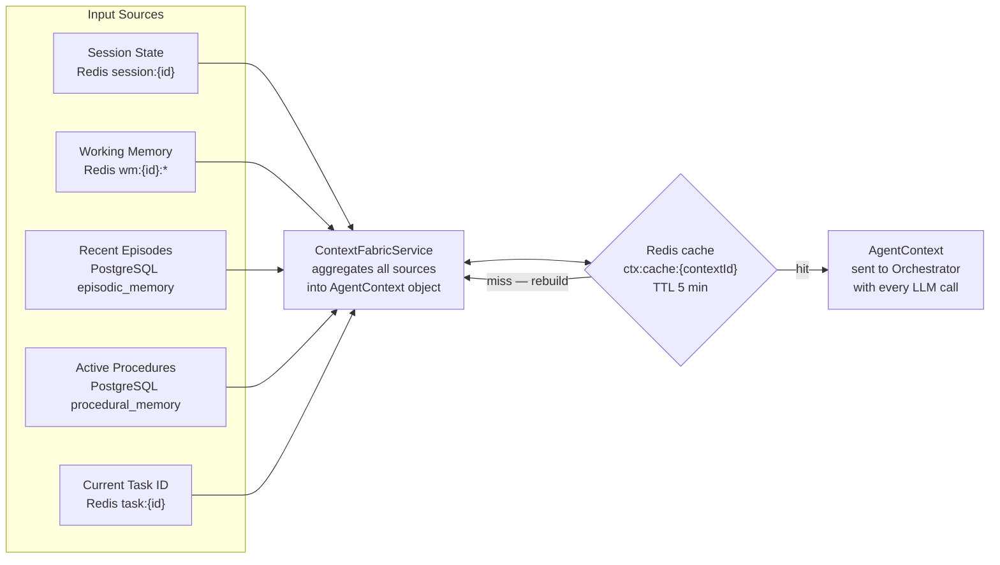

### Memory Tier Comparison

| Tier | Storage | Scope | TTL | Access Pattern |
|------|---------|-------|-----|----------------|
| Working | Redis | Session | 30 min | Key-value read/write |
| Semantic | Qdrant + PG | Global | Permanent (optional expiry) | Cosine vector search |
| Episodic | PostgreSQL + Qdrant | Global | Permanent | SQL + vector similarity |
| Procedural | PostgreSQL | Global | Permanent (versioned) | SQL by trigger_conditions |

---

## 7. Streaming Pipeline

How a single agent response is delivered in real-time from Gemini to the browser.

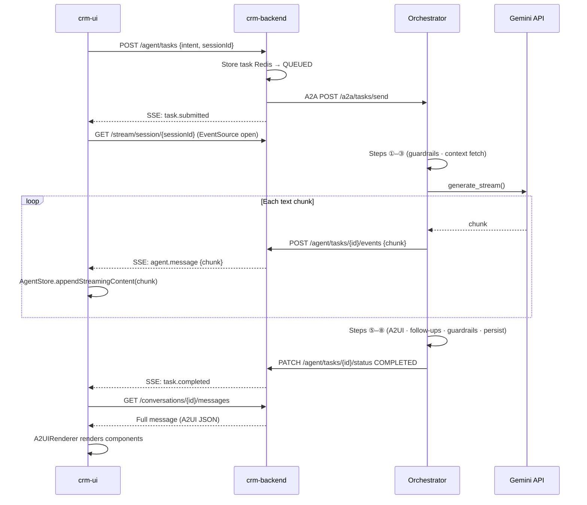

### SSE Emitter Registry

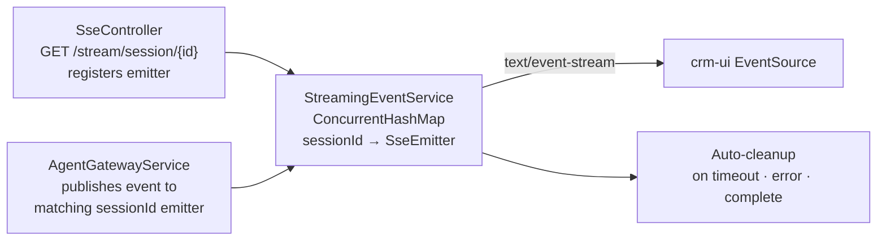

---

## 8. Database Schema

PostgreSQL 16 — entity relationships and immutability constraints.

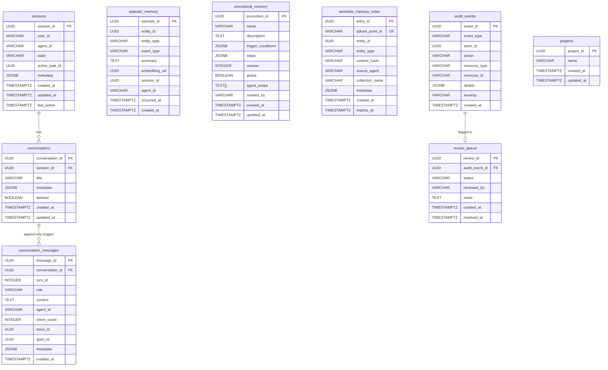

### Flyway Migration Timeline

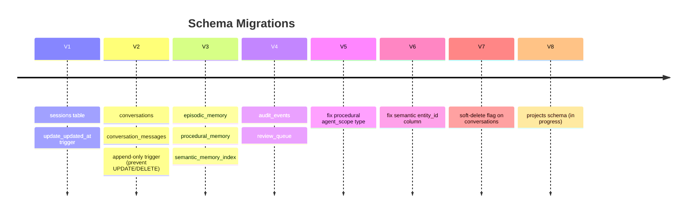

### Redis Key Map

| Key | TTL | Purpose |
|-----|-----|---------|
| `session:{sessionId}` | 30 min | Session cache (userId, agentId, state) |
| `task:{taskId}` | 2 h | A2A task state (intent, status, result) |
| `wm:{sessionId}:task_state` | session | Working memory — reasoning chain |
| `wm:{sessionId}:reasoning` | session | Working memory — LLM steps |
| `ctx:cache:{contextId}` | 5 min | Assembled AgentContext object |
| `lock:task:{taskId}` | 30 s | Distributed lock for task updates |

---

## 9. Infrastructure & Observability

Local dev ports, Docker Compose services, and Kubernetes namespace layout.

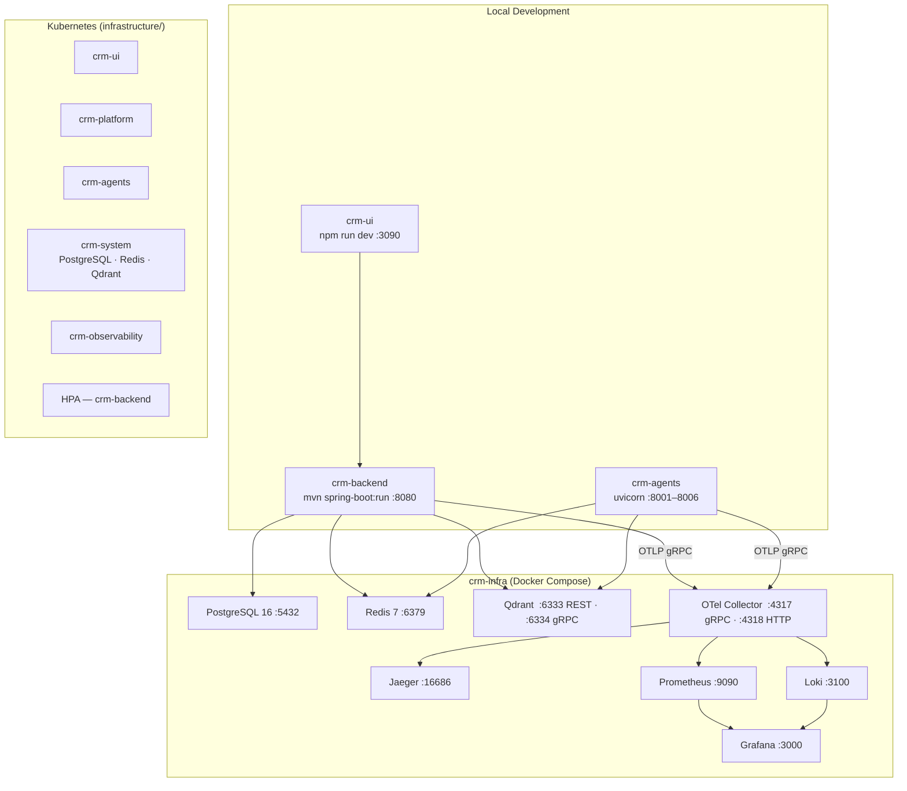

### Distributed Trace Propagation

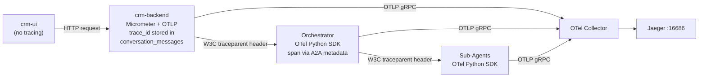

---

## 10. Request Lifecycle — End to End

Full trace of one user message from keypress to rendered A2UI response.

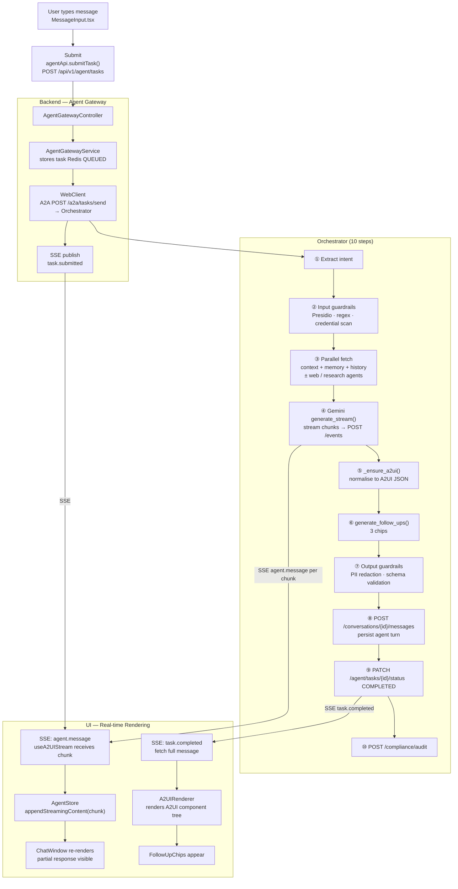

---

## Key Design Decisions

| Decision | Rationale |
|----------|-----------|
| Append-only `conversation_messages` | Tamper-proof history; enforced at DB level via trigger, not application code |
| Fail-open input guardrails | Validation failures never block the user; violations logged for human review |
| Four-tier memory | Each tier has different retrieval semantics — fast session state (Redis), semantic similarity (Qdrant), event timeline (PG), procedural workflows (PG JSONB) |
| Context Fabric with 5-min Redis cache | Avoids re-aggregating all memory sources on every LLM call |
| A2A protocol (Google ADK v0.3) | Standard agent-to-agent contract; task state machine decoupled from HTTP lifetime |
| SSE over WebSocket | Simpler unidirectional push; Spring `SseEmitter` sufficient; no upgrade handshake needed |
| A2UI component whitelist | Agent-generated UI cannot inject unknown components; unknown types silently render null |
| Per-session SSE emitter registry | Events scoped to exactly the requesting user's session; no broadcast leakage |
