# CRM Agentic AI — Complete Architecture Data Flow

```mermaid
flowchart TD
    %% ─────────────────────────────────────────────
    %% BROWSER / UI LAYER
    %% ─────────────────────────────────────────────
    subgraph UI["crm-ui  ·  React 18 + A2UI  (port 3090)"]
        direction TB
        ChatWindow["ChatWindow.tsx"]
        MessageInput["MessageInput.tsx"]
        MessageBubble["MessageBubble.tsx\n+ Follow-up chips"]
        A2UIRenderer["A2UIRenderer.tsx\n(text · markdown · kv_table\nstat_grid · contact_chip\nsection · progress · badge)"]
        StreamHook["useA2UIStream.ts\n(SSE listener)"]
        AgentStore["Zustand Store\n(agentStatus · streamingContent)"]
        SessionCtx["SessionContext\n(sessionId · userId · conversationId)"]

        MessageInput -->|"user types + Send"| ChatWindow
        ChatWindow -->|renders| MessageBubble
        MessageBubble -->|A2UI JSON parsed| A2UIRenderer
        StreamHook -->|chunks / status| AgentStore
        AgentStore -->|agentStatus · content| ChatWindow
        SessionCtx -->|sessionId · conversationId| ChatWindow
    end

    %% ─────────────────────────────────────────────
    %% API CALLS FROM UI
    %% ─────────────────────────────────────────────
    ChatWindow -->|"POST /api/v1/conversations/{id}/messages\n(save user turn)"| BE_Conv
    ChatWindow -->|"POST /api/v1/agent/tasks\n(submit task)"| BE_Agent
    StreamHook -->|"GET /api/v1/stream/session/{sessionId}\n(SSE)"| BE_SSE
    ChatWindow -->|"GET /api/v1/conversations/{id}/messages\n(refresh on done)"| BE_Conv

    %% ─────────────────────────────────────────────
    %% BACKEND LAYER
    %% ─────────────────────────────────────────────
    subgraph BE["crm-backend  ·  Java Spring Boot 3  (port 8080)"]
        direction TB

        subgraph BE_Controllers["Controllers"]
            BE_Agent["AgentGatewayController\nPOST /agent/tasks\nPATCH /agent/tasks/{id}/status\nPOST /agent/tasks/{id}/events"]
            BE_Conv["ConversationController\nPOST /conversations/{id}/messages\nGET  /conversations/{id}/messages"]
            BE_SSE["SseController\nGET /stream/session/{sessionId}"]
            BE_Session["SessionController\nPOST/GET/PUT /sessions"]
            BE_Memory["MemoryController\nworking · semantic · episodic · procedural"]
            BE_Context["ContextFabricController\nGET/POST /context/{contextId}"]
            BE_Compliance["ComplianceController\nPOST /compliance/audit\nGET  /compliance/review"]
        end

        subgraph BE_Services["Services"]
            AgentGwSvc["AgentGatewayService\n(Redis task store)"]
            SseSvc["StreamingEventService\n(SseEmitter registry\nper sessionId)"]
            SessionSvc["SessionService\n(Redis TTL 30 min)"]
            ConvSvc["ConversationService\n(append-only + trigger)"]
            CtxSvc["ContextFabricService\n(aggregates session +\nmemory + procedures\ncached 5 min in Redis)"]
            MemSvc["WorkingMemoryService\nSemanticMemoryService\nEpisodicMemoryService\nProceduralMemoryService"]
            CompSvc["ComplianceService\n(audit + review queue)"]
        end

        BE_Agent --> AgentGwSvc
        BE_Conv --> ConvSvc
        BE_SSE --> SseSvc
        BE_Session --> SessionSvc
        BE_Memory --> MemSvc
        BE_Context --> CtxSvc
        BE_Compliance --> CompSvc

        AgentGwSvc -->|"push SSE event\n(agent.message chunks\ntask.completed / failed)"| SseSvc
    end

    %% ─────────────────────────────────────────────
    %% SSE back to UI
    %% ─────────────────────────────────────────────
    SseSvc -->|"SSE events:\nagent.thinking\nagent.message (chunk)\ntask.completed\ntask.failed"| StreamHook

    %% ─────────────────────────────────────────────
    %% BACKEND → DATA STORES
    %% ─────────────────────────────────────────────
    subgraph DataStores["Data Stores  (crm-system namespace)"]
        direction LR
        PG[("PostgreSQL 16\nsessions\nconversations\nconversation_messages\nepisodic_memory\nprocedural_memory\nsemantic_memory_index\naudit_events\nreview_queue")]
        Redis[("Redis 7\nsession:{id}\nwm:{id}:task_state\nwm:{id}:reasoning\nagent:state:{id}\ntask:{taskId}\nctx:cache:{id}\nlock:task:{id}")]
        Qdrant[("Qdrant v1.9.6\ncrm_semantic\n768-dim Cosine\ncrm_episodic_embeddings\n768-dim Cosine")]
    end

    ConvSvc <-->|"Flyway V1–V4\nimmutable trigger"| PG
    SessionSvc <-->|"TTL 30 min"| Redis
    AgentGwSvc <-->|"task hash TTL 2h"| Redis
    CtxSvc <-->|"ctx:cache TTL 5 min"| Redis
    MemSvc <-->|"semantic / episodic"| Qdrant
    MemSvc <-->|"working / procedural"| PG
    CompSvc <-->|"audit_events\nreview_queue"| PG

    %% ─────────────────────────────────────────────
    %% BACKEND → ORCHESTRATOR (A2A)
    %% ─────────────────────────────────────────────
    AgentGwSvc -->|"POST /a2a/tasks/send\n(A2A protocol v0.3)"| Orch

    %% ─────────────────────────────────────────────
    %% AGENTS LAYER
    %% ─────────────────────────────────────────────
    subgraph Agents["crm-agents  ·  Python + Google ADK"]
        direction TB

        subgraph OrchestratorSvc["Orchestrator  (port 8001)"]
            Orch["orchestrator/agent.py\nhandle_task()"]
            Router["AgentRouter\n(route by skill_id)"]
            TaskMgr["TaskManager\n(delegate · parallel · sequential)"]

            subgraph OrchestratorFlow["Orchestration Steps"]
                Step1["① Extract intent"]
                Step2["② Input Guardrails\n(fail-open)"]
                Step3["③ Parallel fetch\nContext + Memory\n+ History + Web/Research"]
                Step4a["④a Streaming path\n(research / web search)\nGemini generate_stream()"]
                Step4b["④b Structured path\n(CRM entity queries)\nGemini generate()"]
                Step5["⑤ _ensure_a2ui()\nnormalise to A2UI JSON"]
                Step6["⑥ generate_follow_ups()\n3 clickable chips"]
                Step7["⑦ Output Guardrails\n(PII redaction)"]
                Step8["⑧ Persist agent turn\nto conversation"]
                Step9["⑨ update_agent_task_status\nCOMPLETED → backend"]
                Step10["⑩ record_audit_event\nCompliance trail"]
            end

            Orch --> Step1 --> Step2 --> Step3
            Step3 --> Step4a & Step4b
            Step4a --> Step5
            Step4b --> Step5
            Step5 --> Step6 --> Step7 --> Step8 --> Step9 --> Step10
        end

        subgraph SubAgents["Sub-Agents"]
            MemAgent["Memory Agent  (port 8002)\nmemory_read · memory_write\nsemantic_search\nconsolidate_memory"]
            CtxAgent["Context Agent  (port 8003)\nbuild_context · update_context"]
            WebAgent["Web Search Agent\nweb_search skill"]
            ResAgent["News Research Agent\nresearch skill (Perplexity sonar)"]
        end

        subgraph GuardrailsSvc["Guardrails  (port 8004)"]
            GR_Input["Input Guardrails\nPII detector (Presidio)\nPrompt injection (regex)\nToxicity check\nCredential detector"]
            GR_Output["Output Guardrails\nPII redactor\nSchema validator\nHallucination flagger"]
        end

        Orch --> Router --> TaskMgr
        Step2 -->|"POST /guardrails/validate/input"| GR_Input
        Step7 -->|"POST /guardrails/validate/output"| GR_Output
        Step3 -->|"POST /a2a/tasks/send"| MemAgent
        Step3 -->|"POST /a2a/tasks/send"| CtxAgent
        Step3 -->|"if needs_web_search"| WebAgent
        Step3 -->|"if needs_research"| ResAgent
    end

    %% ─────────────────────────────────────────────
    %% SUB-AGENT → BACKEND (memory / context reads)
    %% ─────────────────────────────────────────────
    MemAgent <-->|"GET /api/v1/memory/semantic/search\nPOST /api/v1/memory/episodic"| BE_Memory
    CtxAgent <-->|"GET /api/v1/context/{contextId}"| BE_Context

    %% ─────────────────────────────────────────────
    %% ORCHESTRATOR → BACKEND CALLBACKS
    %% ─────────────────────────────────────────────
    Step4a -->|"POST /api/v1/agent/tasks/{id}/events\n(streaming chunks)"| BE_Agent
    Step9 -->|"PATCH /api/v1/agent/tasks/{id}/status\nCOMPLETED / FAILED"| BE_Agent
    Step10 -->|"POST /api/v1/compliance/audit"| BE_Compliance

    %% ─────────────────────────────────────────────
    %% EXTERNAL AI SERVICES
    %% ─────────────────────────────────────────────
    subgraph ExtAI["External AI Services"]
        Gemini["Google Gemini\n(Vertex AI)\ngemini-2.0-flash\ngenerate() · generate_stream()\ngenerate_follow_ups()"]
        Perplexity["Perplexity API\nsonar model\ndeep research + citations"]
    end

    Step4a & Step4b & Step6 -->|"Vertex AI gRPC"| Gemini
    ResAgent -->|"HTTPS"| Perplexity
    WebAgent -->|"HTTPS"| ExternalWeb[("Web\n(search APIs)")]

    %% ─────────────────────────────────────────────
    %% OBSERVABILITY
    %% ─────────────────────────────────────────────
    subgraph Observability["Observability  (crm-observability namespace)"]
        direction LR
        OtelCollector["OTEL Collector\ntraces · metrics · logs"]
        Jaeger["Jaeger\n(distributed traces)"]
        Prometheus["Prometheus\n(metrics)"]
        Grafana["Grafana\n(dashboards)"]
        Loki["Loki\n(logs + trace_id)"]
    end

    BE -.->|"OTLP gRPC :4317\nmicrometer-tracing-bridge-otel"| OtelCollector
    Agents -.->|"OTLP gRPC :4317\nopentelemetry-sdk"| OtelCollector
    OtelCollector -.-> Jaeger & Prometheus & Loki
    Prometheus -.-> Grafana
    Loki -.-> Grafana

    %% ─────────────────────────────────────────────
    %% KUBERNETES NAMESPACES (annotation only)
    %% ─────────────────────────────────────────────
    subgraph K8s["Kubernetes"]
        NS_UI["crm-ui namespace"]
        NS_BE["crm-platform namespace"]
        NS_Agents["crm-agents namespace"]
        NS_Infra["crm-system namespace\n(PostgreSQL · Redis · Qdrant)"]
        NS_Obs["crm-observability namespace"]
    end

    %% ─────────────────────────────────────────────
    %% STYLES
    %% ─────────────────────────────────────────────
    classDef uiNode fill:#dbeafe,stroke:#3b82f6,color:#1e3a8a
    classDef beNode fill:#dcfce7,stroke:#16a34a,color:#14532d
    classDef agentNode fill:#fef9c3,stroke:#ca8a04,color:#713f12
    classDef guardNode fill:#fce7f3,stroke:#db2777,color:#831843
    classDef dbNode fill:#f3e8ff,stroke:#9333ea,color:#3b0764
    classDef extNode fill:#ffedd5,stroke:#ea580c,color:#7c2d12
    classDef obsNode fill:#f1f5f9,stroke:#64748b,color:#0f172a

    class ChatWindow,MessageInput,MessageBubble,A2UIRenderer,StreamHook,AgentStore,SessionCtx uiNode
    class BE_Agent,BE_Conv,BE_SSE,BE_Session,BE_Memory,BE_Context,BE_Compliance,AgentGwSvc,SseSvc,SessionSvc,ConvSvc,CtxSvc,MemSvc,CompSvc beNode
    class Orch,Router,TaskMgr,Step1,Step2,Step3,Step4a,Step4b,Step5,Step6,Step7,Step8,Step9,Step10,MemAgent,CtxAgent,WebAgent,ResAgent agentNode
    class GR_Input,GR_Output guardNode
    class PG,Redis,Qdrant dbNode
    class Gemini,Perplexity,ExternalWeb extNode
    class OtelCollector,Jaeger,Prometheus,Grafana,Loki obsNode
```

## Key Data Flow Paths

| Path | Trigger | Route |
|------|---------|-------|
| **User message → saved** | Send button | UI → `POST /conversations/{id}/messages` → PostgreSQL |
| **Task submission** | Send button | UI → `POST /agent/tasks` → Redis task store → `POST /a2a/tasks/send` → Orchestrator |
| **SSE stream open** | Page load / task submit | UI → `GET /stream/session/{sessionId}` → SseEmitter registry |
| **Parallel context fetch** | Step ③ in orchestrator | Orchestrator ‖ [Context Agent, Memory Agent, Conversation History, (Web/Research if needed)] |
| **Streaming chunks** | Gemini generate_stream() | Orchestrator → `POST /agent/tasks/{id}/events` → SseEmitter → UI (real-time) |
| **Structured response** | Gemini generate() | Orchestrator → A2UI JSON → `PATCH /agent/tasks/{id}/status COMPLETED` → SSE task.completed → UI fetch messages |
| **Follow-up chips** | After LLM response | Secondary Gemini call → `follow_ups[]` embedded in A2UI JSON |
| **Compliance trail** | Every task completion | Orchestrator → `POST /compliance/audit` → audit_events table |
| **Traces** | Every span | All services → OTLP Collector → Jaeger (linked by trace_id) |
